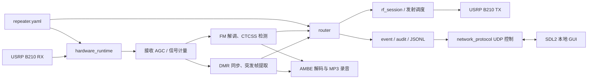

<!--
Compiled and written by BG1KK.
Privatization and closed-source use are strictly forbidden.
GNU Radio components are copyrighted by their respective developers.
All other code copyright © BG1KK.
This copyright statement must be retained.
-->
# 源码结构与文件说明

本文档说明 `source` 镜像中可编译部分的组织、数据流和每个源文件的主要职责。完整工程的部署、配置样例和测试向量仍保留在上级工程根目录中。

## 1. 目录结构

```text
source/
  CMakeLists.txt             独立 CMake 构建入口
  VERSION                    应用版本号
  rpt/                       转发器和 DMR 信号处理源码
    include/dmr_rpt/         转发控制平面接口
    include/dmr_b210/        GNU Radio 帧采样和帧构造接口
    src/                     转发器实现
    gr-dmr/                  本工程使用的 GNU Radio DMR 解码模块
    tests/                   单元测试和命令行验收测试
    check-environment.sh     转发器依赖检查
    configure-build.sh       转发器 Makefile 构建目录配置
  gui/
    main.cpp                 Pi5 本地触摸 GUI
    check-environment.sh     GUI 依赖检查
    configure-build.sh       GUI Makefile 构建目录配置
```

## 2. 程序总体结构



DMR 到 DMR 的实时转发沿透明突发帧路径运行，源 DMR 数据不经过 AMBE 重编码。AMBE 解码仅分支到录音链路。FM 到 DMR 的路径将已解调音频同时送到 AMBE 编码发射和 MP3 录音；FM 转发使用固定源 ID `9999` 和全呼目标 ID。

## 3. 转发器接口文件

| 文件 | 作用 |
| --- | --- |
| `analog_fm.h` | FM 音频、CTCSS 检测和 FM 转 DMR 所需的数据接口。 |
| `audio_recording_runtime.h` | AMBE 解码、PCM 汇集和 MP3 写入运行时接口。 |
| `audit.h` | JSONL 审计和运行日志记录接口。 |
| `config.h` | YAML 配置模型、校验和运行时配置读写接口。 |
| `dmr_burst.h` | DMR 突发、头帧、语音帧和结束帧的统一数据结构。 |
| `event.h` | 收到、开始、转发、拒绝、结束等事件模型。 |
| `hardware_runtime.h` | GNU Radio/UHD 硬件会话和转发运行时工厂。 |
| `interlock.h` | 发射互锁、呼叫生命周期和超时控制接口。 |
| `io_status.h` | RX/TX 状态、RSSI、SNR、增益等状态快照。 |
| `network_protocol.h` | UDP 命令、状态编码和远程控制协议接口。 |
| `receive_agc.h` | 接收增益闭环控制规则。 |
| `receive_signal_metrics.h` | dBFS、SNR 和 200 ms 平均信号强度统计。 |
| `recording.h` | 录音命名、记录元数据和录音会话接口。 |
| `remote_voice.h` | 远程 AMBE 语音控制与网络帧接口。 |
| `rf_session.h` | RF 发射/接收通道配置和实际 B210 会话接口。 |
| `router.h` | DMR 与 FM 业务路由、目标判定和转发决策接口。 |
| `rx_signal_calibration.h` | dBFS 到 dBm 的校准点、曲线拟合和持久化接口。 |
| `sha256.h` | 测试向量和清单完整性校验接口。 |
| `short_message.h` | DMR 短消息提取、构造和转发接口。 |
| `vector_manifest.h` | 测试向量 manifest 解析及硬件档案校验接口。 |
| `dmr_burst_symbol_sampler.h` | GNU Radio 自定义块：从判决后的符号流捕获 DMR 突发。 |
| `dmr_direct_framer.h` | GNU Radio 直发帧发生器接口。 |
| `dmr_direct_frame_builder.h` | 从 AMBE dibit 生成 DMR 头帧、语音帧和结束帧。 |
| `dmr_short_message_frame_builder.h` | 构造 DMR 短消息数据帧。 |

## 4. 转发器实现文件

| 文件 | 作用 |
| --- | --- |
| `src/main.cpp` | 程序入口；解析命令行、加载配置、启动 UDP 服务、输出状态和协调硬件运行时。 |
| `src/hardware_runtime.cpp` | 创建 GNU Radio 流图和 UHD B210 RX/TX；完成 DMR/FM 分类、实时收发、AGC、录音分流。 |
| `src/analog_fm.cpp` | FM 静噪、CTCSS、音频帧与 FM 呼叫状态处理。 |
| `src/audio_recording_runtime.cpp` | AMBE 解码为 PCM，并用 LAME 压缩为 MP3。 |
| `src/audit.cpp` | 将事件按 JSONL 形式写入日志。 |
| `src/config.cpp` | 加载、验证、保存 YAML 配置，包括信道和 RSSI 校准曲线。 |
| `src/dmr_burst.cpp` | 解析和分类 DMR 突发，提取 ID、色码、时隙和语音内容。 |
| `src/event.cpp` | 格式化标准运行事件、短状态词元和日志内容。 |
| `src/interlock.cpp` | 防止不符合状态的同时发射，处理结束和超时。 |
| `src/io_status.cpp` | 汇总硬件状态，生成 GUI 和日志使用的状态数据。 |
| `src/network_protocol.cpp` | UDP 请求解析、响应和版本/状态/校准/控制命令实现。 |
| `src/recording.cpp` | 录音文件名、录音元数据和音频记录业务逻辑。 |
| `src/remote_voice.cpp` | 远程 AMBE 音频收发和会话管理。 |
| `src/rf_session.cpp` | B210 射频参数应用、通道切换和 TX 控制。 |
| `src/router.cpp` | 根据接收业务、配置、目标 ID 和互锁状态作出转发或拒绝决定。 |
| `src/rx_signal_calibration.cpp` | 校准点排序、分段拟合、dBFS/dBm 转换及 YAML 写回。 |
| `src/sha256.cpp` | SHA-256 算法实现。 |
| `src/short_message.cpp` | DMR 短消息重组、过滤和发帧。 |
| `src/vector_manifest.cpp` | 测试向量 manifest 读取与硬件档案核验。 |
| `dmr_direct_framer.cpp` | DMR 直发帧生成器实现，供 FM 转 DMR 和测试使用。 |
| `dmr_short_message_frame_builder.cpp` | DMR 短消息帧构造器实现，供短消息单元测试和后续业务发送复用。 |
| `gr_dmr_frame_decoder_impl.cc` | `gr-dmr` 的 GNU Radio DMR 帧解码块实现。 |

`rpt/gr-dmr/` 是随源码镜像保存的 GNU Radio OOT 模块：其 `CMakeLists.txt` 构建 `gnuradio::gnuradio-dmr` 动态库；`include/gnuradio/dmr/frame_decoder.h` 声明帧解码块；`lib/frame_decoder_impl.h` 实现块状态机；`lib/dmr_slot.*` 处理时隙、色码和嵌入信令；`lib/edac/golay24.h` 与 OP25 的 BPTC、Hamming、Trellis 源码共同完成纠错；`python/` 只保存可选 Python 绑定，独立转发器构建默认关闭。

## 5. GUI 文件

| 文件 | 作用 |
| --- | --- |
| `gui/main.cpp` | SDL2/KMSDRM 触摸界面；绘制主页、信道、参数、实时状态和 RSSI 校准页面；通过 UDP 查询和控制转发器。GUI 同时显示版本、在线状态、运行时长、FM/DMR 信号、录音存储占用、校准表及通道配置。 |

## 6. 测试文件

| 文件 | 作用 |
| --- | --- |
| `repeater_contract_tests.cpp` | 依据 YAML 配置与 828S 向量验证转发器合同约束。 |
| `network_protocol_tests.cpp` | 验证 UDP 命令、响应和状态字段。 |
| `audio_recording_tests.cpp` | 验证录音命名、音频记录和 MP3 相关逻辑。 |
| `dmr_burst_symbol_sampler_tests.cpp` | 验证 DMR 符号采样、同步和突发输出。 |
| `dmr_short_message_frame_builder_tests.cpp` | 验证短消息 DMR 数据帧生成。 |
| `expect_cli_help.cmake` | 验收程序帮助参数输出。 |
| `expect_cli_overrides.cmake` | 验收命令行配置覆盖行为。 |

## 7. 使用 CMake 和 Makefile

在 Pi5 的 Linux 环境中执行。脚本会先检查依赖，再创建使用 Unix Makefiles 的构建目录。

```bash
cd source/rpt
chmod +x check-environment.sh configure-build.sh
./configure-build.sh
cmake --build ../build-rpt -j"$(nproc)"
ctest --test-dir ../build-rpt --output-on-failure
```

仅构建 GUI：

```bash
cd source/gui
chmod +x check-environment.sh configure-build.sh
./configure-build.sh
cmake --build ../build-gui -j"$(nproc)"
ctest --test-dir ../build-gui --output-on-failure
```

`rpt/gr-dmr` 复用 OP25 的纠错编码源码。若其不在默认位置，配置前设置：

```bash
export OP25_REPEATER_SOURCE_DIR=/path/to/op25/gr-op25_repeater/lib
export MBELIB_ROOT=/path/to/gr-dsd
```

随后可在同一个构建目录中直接调用 `make`，例如 `make -C ../build-rpt -j"$(nproc)"`。构建入口不包含部署配置、生产 YAML 和测试 IQ 向量；需要完整生产构建与部署时仍应使用工程根目录的 `CMakeLists.txt` 和 `deploy/` 脚本。
